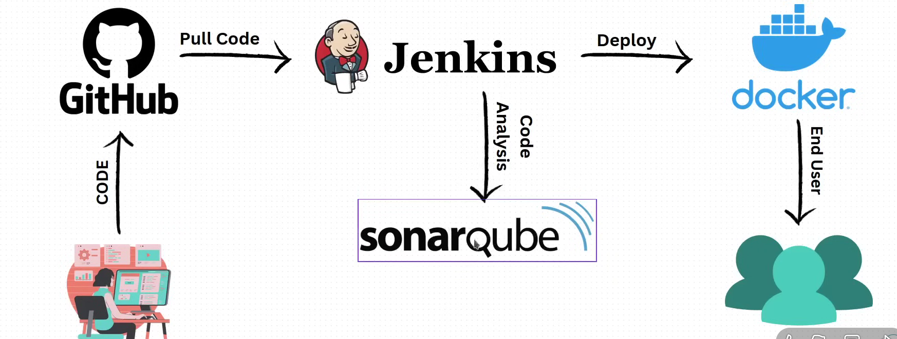
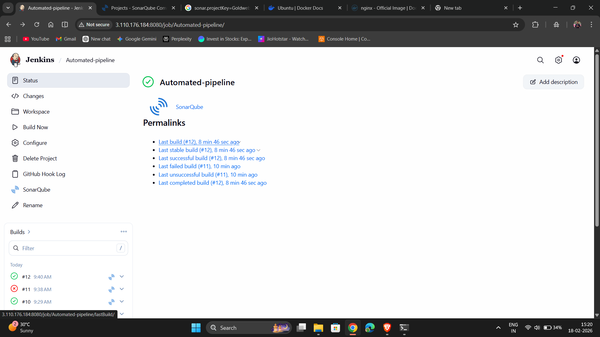
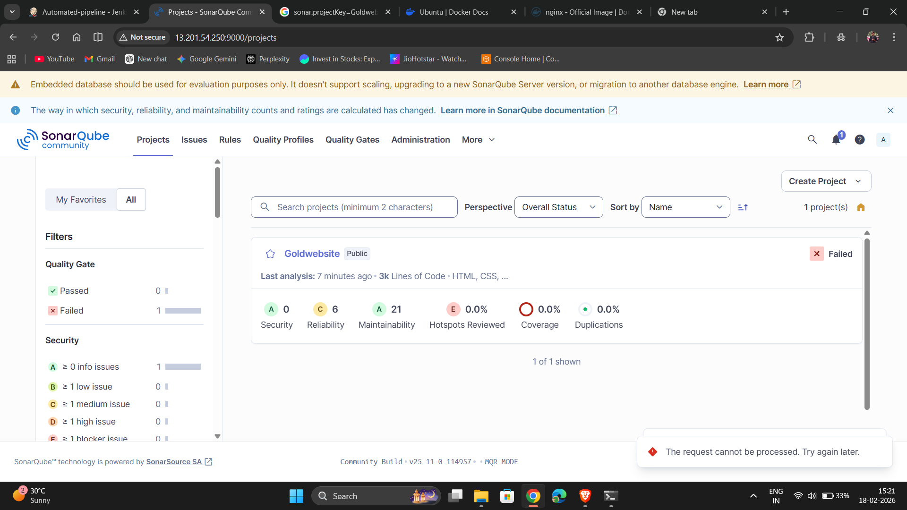
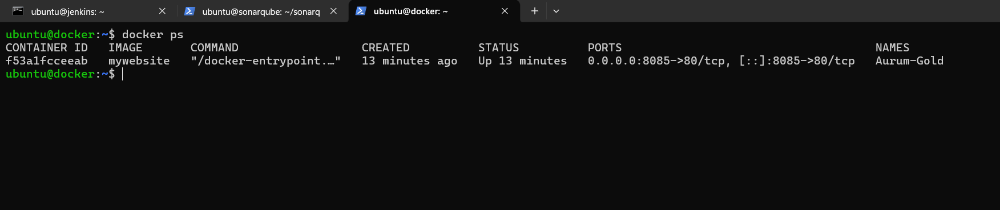
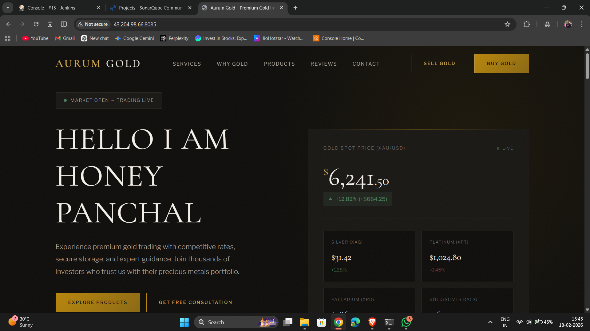

# 🚀 Automated CI/CD Pipeline Using Jenkins, SonarQube & Docker on AWS EC2

Designed and implemented an automated CI/CD pipeline using Jenkins, SonarQube, Docker, and AWS EC2 to deploy a containerized web application with automated quality analysis and zero-manual deployment.

This project demonstrates a fully automated CI/CD pipeline that integrates:

GitHub (Source Code Management)

Jenkins (Automation Server)

SonarQube (Code Quality Analysis)

Docker (Containerization)

AWS EC2 (Cloud Infrastructure)
## 🏗️ Architecture Diagram
  
## 🔄 CI/CD Workflow
Step 1: Code Push

Developer pushes code to GitHub repository.

Step 2: Jenkins Trigger

GitHub webhook triggers Jenkins automatically.

Step 3: Code Quality Scan

SonarQube analyzes:

Code smells

Bugs

Vulnerabilities

Maintainability

Step 4: Build & Deploy

Jenkins:

Copies project to remote Docker server using SCP

Removes old container

Builds new Docker image

Deploys updated container

Step 5: Live Deployment

